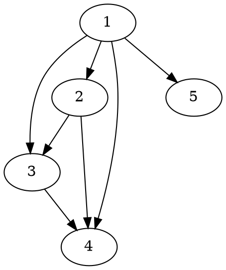

<div class="note">

**Summary:** Sometimes using specialized tools proves to be very convenient. To quickly visualize network graphs, I tried to use [Graphviz](https://graphviz.org/) program (invoking a stand-alone app from within Julia). It worked pretty well, both in terms of "UI" and the figures' quality. Here I provide the minimal code I used and a couple complications, such as plugging in TeX with its PGF/TikZ instead of Graphviz (see also buttons below the title for source code files).

Of course, the idea is not new --- see, e.g., [PGFPlots.jl](https://nbviewer.jupyter.org/github/JuliaTeX/PGFPlots.jl/blob/master/doc/PGFPlots.ipynb) for a full-blown interface to PGFPlots --- but hopefully demonstrates the point.

**Discussion:** I'd appreciate any comments / suggestions! Pls reach out via [email](/contact).

</div>


## Use-case and the problem {#use-case-and-the-problem}

I have been working with networks in Julia and needed to quickly examine them visually. In particular, **my use-case** is that I am developing a graph-based algorithm and need:

-   to look at an example instance graph. Usually, it is relatively small, up to several dozens of nodes.
-   to visualize certain graphs decorated with additional data, such as a branch-and-bound search tree or Monte-Carlo search tree.

The package I am working with, [LightGraphs.jl](https://juliagraphs.org/LightGraphs.jl/latest/), does [provide different ways](https://juliagraphs.org/LightGraphs.jl/latest/plotting/) to plot graphs by integrating with other packages, and this, of course, is a good starting point. However, for my specific (REPL-based) setup[^fn:1] it just did not work nicely out of the box. Also, it perhaps required learning another domain-specific language (within Julia) for customizations. For example, I am doing Interdiction, and I want _source_ and _destination_ nodes filled with different colors. I might want even more freedom in formatting of a branch-and-bound tree. This is not bad per se, but I want to be sure that this new language is **pretty good** before learning it.

</details>

But then I thought, if I use R with (totally amazing) [ggplot2](https://ggplot2.tidyverse.org/) to visualize the data from `csv` files generated elsewhere --- why not to do the same with graphs? [Unix way](https://en.wikipedia.org/wiki/Unix%5Fphilosophy#Do%5FOne%5FThing%5Fand%5FDo%5FIt%5FWell) and all... Apparently, this is both very easy to do and capable of producing nice output.


## A quick, but efficient hack {#a-quick-but-efficient-hack}

My tool of choice for visualizing graphs from the previous project was a stand-alone program[^fn:2] called _Graphviz_ (`dot` command). To use it, I would just need to form and compile a plain-text `.dot` file written in [DOT language](https://graphviz.org/gallery/). This is straightforward to do automatically. Assuming I have a `SimpleDiGraph` named `G` that I'd like to visualize, I can do:

```julia
open("./graph.tmp.dot", "w") do file
    write(file, "digraph {\n")

    for n in vertices(G)  # add nodes
        write(file,
              "    $n;\n")
    end

    for e in edges(G)  # add edges
        i=src(e); j=dst(e)
        write(file,
              "    $i -> $j;\n")
    end

    write(file, "}")
end
```

<details> <summary> [What does this code produce?]</summary>

A resulting `.dot` file might look like this, for a five-nodes graph:



</details>

Now, this totally works, but I would need to compile it manually, that's not user-friendly. Luckily, this is trivial to fix by adding:

```julia
run(pipeline(`dot -Tpdf ./graph.tmp.dot`,
             stdout="./graph.tmp.pdf"))
run(`xdg-open $filename.pdf`, wait=false)
```

(Note that these are backticks, `` ` ``, not quotes `'`!)

So, it will produce `./graph.tmp.dot`, compile it with the program `dot`, and open[^fn:3] the resulting PDF with the default viewer in a separate window! (The REPL will not be blocked since we asked it not to with this `wait = false`.)

But wait, there's more. It immediately gives us all the power of DOT language directly (which was, ehm, designed specifically to draw graphs!). Say, if I want to mark _source_ and _dest_ nodes with different colors, and show arc costs as well, I can modify the code above as follows:

```julia
"""Shows the graph with source node `s`,
dest `t`, and arc costs `W`."""
function showgraph(G, s, t, W,
                   filename="./graph.dot",
                   display=true)

    open(filename, "w") do file
        write(file, "digraph {\n")
        for n in vertices(G)  # add nodes
            if n == s
                style = "[style=filled, fillcolor=red]"
            elseif n==t
                style = "[style=filled, fillcolor=green]"
            else
                style = ""
            end
            write(file,
                  "    $n $style;\n")
        end

        for e in edges(G)  # add edges
            i=src(e); j=dst(e); cost=W[(i,j)]
            write(file,
                  "    $i -> $j" *
                      " [label=$(cost)];\n")
        end
        write(file, "}")
    end

    run(pipeline(`dot -Tpng $filename`,
                 stdout="$filename.png"))
    if display
        run(`xdg-open $filename.png`,
            wait=false)
    end
end
```

So, if I want to quickly look at graph `G` with source `s`, terminal `t`, and costs `W`, I just do `showgraph(G,s,t,W)` and a new window pops up:


Now, if I want to examine _two_ graphs (and save them as different files), I can call `showgraph(G,s,t,W, "file1")` and `showgraph(G2,s2,t2,W2, "file2")`. If I just want to update the file, without opening another window (e.g., if it is already open), I can ask to `showgraph(G,s,t,W, "file", false)`.


## Further improvement {#further-improvement}

Since we have just hacked the function together ourselves, it is really easy to modify. Assume I am drawing some more complicated things, and want to show more details about my nodes, which I have in `names` and `info` (indexed by the node number). Maybe, also format edge labels in some special way. It does not require any new ideas:

```julia
function showgraph_more(G, s, t, W,
                   names,
                   info,
                   filename="./graph.dot",
                   display=true)

    open(filename, "w") do file
        write(file, "digraph {\n")
        for n in vertices(G)  # add nodes
            if n == s
                style = "style=filled, fillcolor=red,"
            elseif n==t
                style = "style=filled, fillcolor=green,"
            else
                style = ""
            end

            label = "<<B>Name:</B> $(names[n])<BR/>" *
                "<B>Info:</B> $(info[n])<BR/>" *
                "<B>Node number:</B> $n>"

            write(file,
                  "    $n[$style label=$label]\n")
        end

        for e in edges(G)  # add edges
            i=src(e); j=dst(e); cost=W[(i,j)]
            write(file,
                  "    $i -> $j" *
                      " [label=\"added cost $(cost)\"];\n")
        end
        write(file, "}")
    end

    run(pipeline(`dot -Tpng $filename`,
                 stdout="$filename.png"))
    if display
        run(`xdg-open $filename.png`, wait=false)
    end
end
```

So, `showgraph_more(G, s, t, W, names, info)` again gives a picture in a new window:


(Here I used DOT markup: `<B>...</B>` for Bold, `<SUB>...</SUB>` for subscripts, and [so on](https://graphviz.org/doc/info/shapes.html#html)).

No doubt, DOT language is still somewhat limited, but again, it is a stand-alone, easy-to-plug tool. Also, we don't discuss super-fancy publication-ready figures. Unless you want to...


### Go TikZ! {#go-tikz}

Well, at this point nothing prevents us from employing even more complex tools, should we need some formatting heavy-lifting. There is basically no difference for us which "backend" to choose, even TeX-based! So, rewriting the simpler version of the function above for [PGF/TikZ](https://github.com/pgf-tikz/pgf):

```julia
"""Draws a graph using TikZ."""
function showgraph_tikz(G, s, t, W,
                   filename="./graph",
                   display=true)

    # Let's insert some boilerplate styling
    # and necessary preamble/postamble
    preamble = """\\documentclass{standalone}
\\usepackage{tikz}
\\usetikzlibrary{graphs,graphdrawing,quotes}
\\usegdlibrary{force}

\\begin{document}
\\begin{tikzpicture}
  \\graph [spring layout, node distance=20mm,
 nodes={draw, circle, fill=blue, text=white},
  edge quotes={fill=yellow, inner sep=2pt}]
  {\n"""

    postamble = """};
\\end{tikzpicture}
\\end{document}"""

    open(filename * ".tex", "w") do file
        write(file, preamble)
        for n in vertices(G)
            if n == s
                style = "fill=red, text=white"
            elseif n==t
                style = "fill=green, text=black"
            else
                style = "fill=white, text=black"
            end

            write(file,
                  "    $n [as={\$n_{$n}\$}, $(style)];\n")
        end

        for e in edges(G)
            i = src(e); j = dst(e)
            cost = W[(i, j)]
            write(file,
                  "    $i ->[\"$(cost)\"] $j;")
        end
        write(file, postamble)
    end

    run(pipeline(`lualatex $filename`))
    if display
        run(`xdg-open $filename.pdf`, wait=false)
    end
end
```

<details> <summary> [What does this code produce?]</summary>

That's just a good old `.tex` file:

```latex
\documentclass{standalone}
\usepackage{tikz}
\usetikzlibrary{graphs,graphdrawing,quotes}
\usegdlibrary{force}

\begin{document}
\begin{tikzpicture}
  \graph [spring layout, node distance=20mm, nodes={draw, circle, fill=blue, text=white},
  edge quotes={fill=yellow, inner sep=2pt}]
  {
    1 [as={$n_{1}$}, fill=green, text=black];
    2 [as={$n_{2}$}, fill=white, text=black];
    3 [as={$n_{3}$}, fill=white, text=black];
    4 [as={$n_{4}$}, fill=red, text=white];
    5 [as={$n_{5}$}, fill=white, text=black];
    1 ->["1"] 2;    1 ->["9"] 3;    1 ->["1"] 4;    1 ->["6"] 5;    2 ->["7"] 3;    2 ->["5"] 4;    3 ->["5"] 4;};
\end{tikzpicture}
\end{document}
```

</details>

A call to `showgraph_tikz(G,s,t,W)` summons the unlimited power of TeX, so we spend some time looking at `lualatex` compilation log, but then indeed see a formatted digraph, as a PDF in a new window:


Of course, here we have [all the tools](https://pgf-tikz.github.io/pgf/pgfmanual.pdf) (that was a link to a manual of more than 1,000 pages) of TikZ/PGF. We just generate and then compile a `.tex` file under the hood, nothing fancy.


## In conclusion {#in-conclusion}

So, while using _TikZ_ seems like a little overkill for daily use, I really like the balance of simplicity and results with _Graphviz_. However, I might consider the former for producing the final versions of some figures and publication-ready supplemental materials next time.

Finally, while it seems really efficient as a quick and flexible tool, note that there are more general and, perhaps, tidy solutions that interface Julia and other systems --- see, e.g., [JuliaTeX](https://github.com/JuliaTeX) with its PGFPlots, TikzGraphs / TikzPictures, and such. But hopefully this note illustrates the fact that sometimes using tools from seemingly different ecosystems might be pretty handy and simple.

_Please, feel free to drop me an [email](/contact) if you'll have any comments or suggestions!_

[^fn:1]: My setup comprises my editor, Emacs, and Julia REPL running in a terminal side by side, with a decent degree of interactivity provided by [Revise.jl](https://timholy.github.io/Revise.jl/stable/). Many problems might be nonexistent, say, in [Jupyter](https://jupyter.org/) or [VSCode](https://www.julia-vscode.org/). But that's not the way I was ready to pursue at the moment, since I find the whole setting pretty convenient.
[^fn:2]: Which I installed with `sudo apt install graphviz` on my Debian system. (Would work the same way on Ubuntu, but you'd need to `brew install graphviz` on Mac. There are [options](https://graphviz.org/download/).)
[^fn:3]: Technically speaking, this code will run on most Linuxes only, since I am using the program `xdg-open`, which opens stuff in the default app. As far as I know, the Mac equivalent is `open`.
